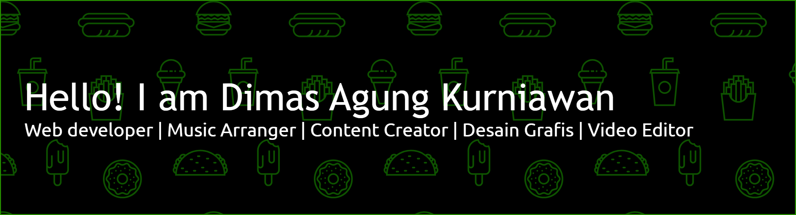

---
<!--
#### Welcome to my GitHub repository. I'm currently actively participating in two awesome courses: AWS re/Start and the HACKTIV8 Student Developer Initiative with IBM.

<!--
**dimasagng/dimasagng** is a ✨ _special_ ✨ repository because its `README.md` (this file) appears on your GitHub profile.

Here are some ideas to get you started:

- 🔭 I’m currently working on ...
- 🌱 I’m currently learning ...
- 👯 I’m looking to collaborate on ...
- 🤔 I’m looking for help with ...
- 💬 Ask me about ...
- 📫 How to reach me: ...
- 😄 Pronouns: ...
- ⚡ Fun fact: ...
-->

<!--
##### ☁️ AWS re/Start - Cloud Career Program (Batch 12)

_Hosted by [**Orbit Future Academy**](https://www.instagram.com/orbitfutureacademyid?utm_source=ig_web_button_share_sheet&igsh=ZDNlZDc0MzIxNw==) in collaboration with AWS._

**📅 Duration: 3 Months**
**📚 I'm Learning:**

- Cloud Computing Fundamentals
- Linux, Networking, Security
- AWS Services (EC2, S3, VPC, IAM)
- Python for Cloud
- Soft Skills & Career Readiness

---

##### 🤖 Generative AI Student Developer Initiative In collaboration with Hacktiv8 & IBM SkillsBuild.

_This program focuses on developing practical skills in AI using tools like **IBM Granite.** I'm taking the Code Generation & Optimization class, which is perfect for my developer background._

**📚 I'm Learning:**
**Code Generation & Optimization**

- Generative AI Fundamentals
- Prompt Engineering
- Code Generation
- Performance Optimization

---
-->

##### Language

##### Social Media

_I'm excited to share my learning journey here. Please feel free to explore the code, and if you have any questions or feedback, don't hesitate to reach out._ \*_Happy coding! ✨_
